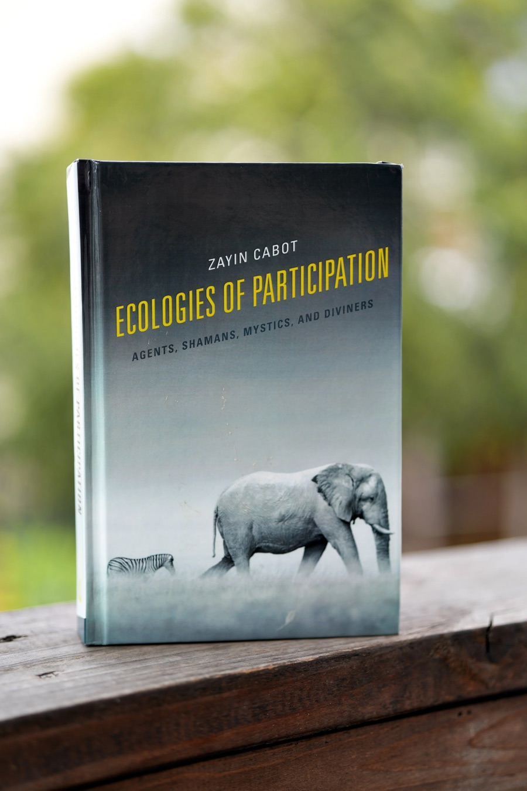

One book published; the next being written. The books are the slow
form of this work — the garden moves faster, but the books go deeper.

• • • —

## Ecologies of Participation

*Agents, Shamans, Mystics, and Diviners* — Lexington Books, 2018.

A daring debut that challenges the "wise homebodies" of academia by
proposing a profoundly interdisciplinary methodology for comparative
philosophy and religious studies. Grounded in process philosophy, the
book advances a new ontology of agency and develops a multi-ontology
approach that moves beyond both the reductionism of scientific
materialism and the relativism of postmodern constructivism. Drawing
on Lévy-Bruhl, Lévi-Strauss, and the ontological turn in
anthropology, it shows how diverse *ecologies of participation* —
shamanic, mystic, divinatory, and agential — offer different ways of
world-making that destabilize the givenness of "nature" and
"culture." The closing chapters extend these insights into an ethics
of comparison and a participatory *guest protocol* — a fertile ground
for facing our shared planetary predicament. The seed of everything
this site now articulates as [[tending]] is already growing here.

> "Ecologies of Participation is impossible to capture in some neat,
> established academic sound-bite, mostly because its multiple claims
> are all quite impossible — impossible, that is, within our present
> Western and colonized ways of speaking, thinking, and being. If we
> can imagine ourselves outside or after that framework, we might say
> that the book, like its author, is a shaman, a diviner, and a
> traveler among worlds, including future worlds. The vision of the
> human (and nonhuman) that emerges through these words and worlds is
> unabashedly global, comparative, moral, and magical. Here is a weird
> and wonderful book in which everything is alive and even the stones
> tell stories. Really."
> — **Jeffrey Kripal**, Rice University

> "A joyful, verve-driven contribution to the conversation about the
> role of ontological difference in getting a handle on what used to
> be called cultural diversity. Impressive in its scope and ambition,
> this book takes the whole debate about ontology in the humanities
> and social sciences to places it has never been before."
> — **Martin Holbraad**, University College London

Available from
[Lexington / Rowman & Littlefield](https://rowman.com/ISBN/9781498568159)
and [Amazon](https://www.amazon.com/Ecologies-Participation-Diviners-Postcolonial-Decolonial/dp/1498568157).

## What is being written

The next books are underway — the fuller articulation of the work
this garden holds in miniature. News will arrive here, and in the
letters, when they are ready.
